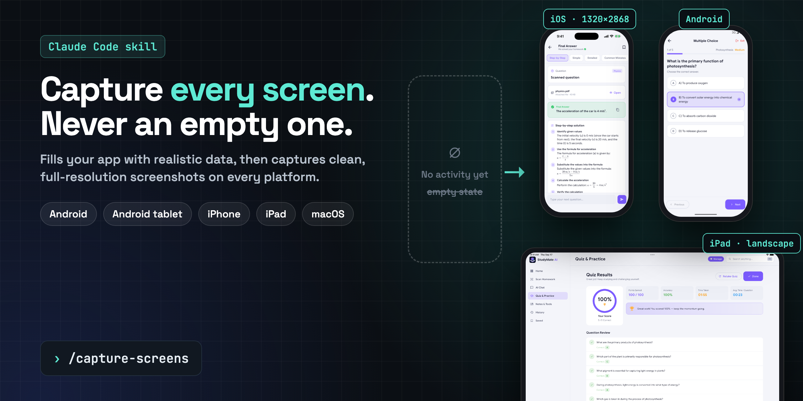

<p align="center"></p>

# capture-screens

A [Claude Code](https://claude.com/claude-code) skill that **fills your app with realistic data and then captures every screen** - on Android, Android tablet, iPhone, iPad and macOS - as clean, full-resolution screenshots ready for the App Store, Google Play or your docs.

Empty states make terrible screenshots. "No activity yet", a zero streak, a blank chat - nobody installs that. This skill makes Claude use your app like a real user first (solve problems, run chats, finish quizzes, generate content, switch theme and language), check the results are correct, and only then capture.

```
› /capture-screens
```

## What it does

- **Data before capture.** Drives the running app on each emulator/simulator and fills every feature with varied, realistic content. Never saves an empty screen - an `empty` check flags mostly-blank captures.
- **Every platform Claude can drive.**

  | Platform | Device | Output |
  |---|---|---|
  | Android phone | emulator / device via `adb` | 1080×2400 |
  | Android tablet | 10″ emulator, landscape | 2560×1600 |
  | iPhone | iPhone Pro Max simulator | 1320×2868 |
  | iPad | iPad Pro 13″ simulator, **landscape** | 2752×2064 |
  | macOS | the app window | Retina window size |

- **Store-clean status bars** - 9:41, full battery and signal, no notifications (Android demo mode, `simctl status_bar`), restored afterwards.
- **Variants the listing needs** - light and dark, plus localized screens.
- **No real purchases** - paid features are unlocked through the app's own test switch.
- **Honest reporting** - bugs, untranslated strings and wrong AI answers spotted while capturing are listed for you instead of being quietly captured around.
- **Leaves devices as it found them** - language, theme and status bar reset.

Captures land in `docs/screenshots/<platform>/NN_screen[_variant].png`, ready for the companion skill [**store-screenshots**](https://github.com/iamaz007/store-and-web-screenshots-claude-skill), which turns them into designed store tiles.

## Install

```bash
git clone https://github.com/iamaz007/capture-screens-claude-skill.git ~/.claude/skills/capture-screens
pip install pillow numpy
```

Requirements: `adb` (Android SDK platform-tools) for Android, Xcode command-line tools for iOS/iPad, macOS for iOS and Mac captures, Python 3.

## Use

Start your emulator/simulator with the app (or let Claude build and launch it), then in Claude Code:

```
/capture-screens
```

or just ask: *"take screenshots of every screen on Android and iPad, fill it with data first"*.

## The helper: `scripts/cap.sh`

```bash
cap.sh devices                           # connected Android devices + booted simulators
cap.sh clean android|ios                 # store-clean status bar
cap.sh shot android|ios|ipad-land|mac OUT.png [id|App]
cap.sh type ios "text"                   # reliable typing into the simulator
cap.sh clear ios|android                 # select-all + delete in the focused field
cap.sh push android|ios FILES...         # seed photos into the gallery / Photos
cap.sh files ios FILES...                # seed PDFs into the Files app
cap.sh rotate ios right                  # iPad to landscape
cap.sh empty OUT.png                     # warn if a capture looks empty
cap.sh unclean android|ios               # restore the status bar
```

## License

MIT
